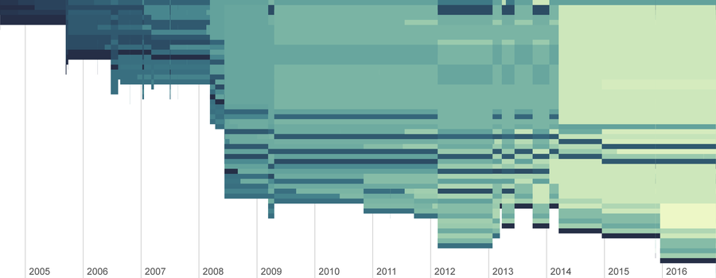

# Wikipedia Stratigraphy

Some code for extracting and visualising [Wikipedia article histories](http://fogonwater.com/blog/2015/11/wikipedia-edit-history-stratigraphy/). This code is a bit of a mess and would benefit from a serious tidy. Fails on articles with a very large number of edits. I also suspect there is something funky about the way the most recent edit displays.

Written in Python 2.7.x. Untested with Python 3.x.



Example visualisation for the [Tirau](https://en.wikipedia.org/wiki/Tirau) article's edit history. Each graphic represents the history of a single article. Time moves from left to right. The varying heights of the coloured section of represent how many lines an article had at each point in time. Articles typically start short and become longer over the years. The oldest unchanged lines from the article are shaded deep blue; newer sections are shaded pale yellow.

The script also produces visualisations of anonymous edits and contributions by unique editors.

## Installation

1. Create and activate a virtual environment (e.g. `virtualenv venv` then `source venv/bin/activate`)
2. Install modules with the requirements file: `pip install -r requirements.txt`

## Basic usage

Test the script is working by running `wikistrat.py` in a directory that contains folders named `wikixml` and `img`.

```
$ python wikistrat.py
```

The script should download the [Tirau](https://en.wikipedia.org/wiki/Tirau) article's history to `wikixml` and create three visualisations in the `img` directory.

Set up a Wikipedia stratigraphy object.

```
import wikistrat
wiki = WikiStrat()
```

WikiStrat retrieves xml histories from Wikipedia and stores them in a data directory. Visualisations get created in an image directory. By default these are expected to be `wikixml` and `img` respectively. You can configure these directories with the `data_dir` and `img_dir` parameters.

```
wiki = WikiStrat(data_dir='folder1', img_dir='folder2)
```

Extract and visualise Wikipedia article histories with the parse method.
```
wiki.parse('Tirau')
```

By default the parse method will only download an article's history if there is no local copy. To force a refresh, set `refresh=True`.

```
wiki.parse('Tirau', refresh=True)
```
